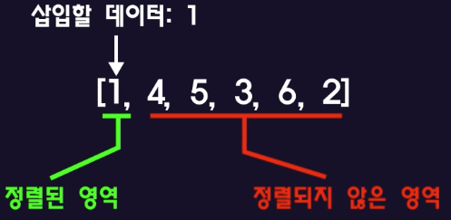

## 삽입정렬

- 삽입정렬은 정렬되지 않은 영역에서 데이터를 하나씩 꺼내서 정렬된 영역 내 적절한 위치에 "삽입"해서 정렬하는 알고리즘이다.
- 삽입정렬의 동작
  - 1부터 6까지 무작위로 들어있는 배열이있다 이를 삽입정렬을 이용하여 오름차순으로 정렬해보자.
  - `[4, 1, 5, 3, 6, 2]`
  - 맨 앞의 4를 제외한 나머지 수들을 정렬되지 않은 영역이라 정하자.  
    (삽입정렬에서 첫 번째 원소는 이미 정렬되어 있다고 가정한다.)  
    
  - 정렬되지 않은 영역의 첫 번째 원소 1을 정렬된 영역에 삽입하여 정렬해보자.
  - 정렬된 영역의 마지막 원소 4와 삽입할 데이터 1을 비교한 후,  
    정렬된 영역의 마지막 원소가 삽입할 데이터보다 더 크다면, 다음 인덱스에 덮어써준다.  
    
  - 이전 인덱스로 이동하며 데이터를 비교해야 하지만 더 이상 데이터가 없기 때문에,
    마지막에 비교한 데이터 4 위치에 삽입할 데이터를 삽입해준다.  
    
  - 정렬되지 않은 영역의 가장 첫 번째 요소를, 정렬된 영역의 가장 뒤에 있는 원소부터 역순으로 비교한다.  
    
  - 5는 정렬된 영역의 1, 4 보다 크므로 현재 자리에 그대로 있는 것이 정렬된 상태이다.
  - 마찬가지로 정렬되지 않은 영역의 첫 번째 요소와 정렬된 영역의 마지막 원소부터 역순으로 비교한다.  
    
  - 5는 3보다 크므로 5를 바로 다음 인덱스에 덮어 써준다.  
    
  - 이전 인덱스로 넘어가서 비교한 후, 4는 3보다 크므로 다음 인덱스에 덮어 써준다.  
    
  - 이젠 인덱스로 넘어가서 비교한 후, 1은 3보다 작으므로 3을 1의 다음 인덱스에 덮어 써준다.  
    
  - 이 처럼 정렬된 영역의 마지막 인덱스에서 이전 인덱스로 이동하면서,  
    삽입할 데이터가 비교한 인덱스 보다 작으면, 비교한 인덱스의 데이터를 다음 인덱스에 덮어 써주고,  
    삽입할 데이터가 비교한 인덱스 보다 크면, 삽입할 데이터를 다음 인덱스에 덮어 써준다.
  - 이를 반복하면 `[1, 2, 3, 4, 5, 6]`와 같이 배열의 모든 요소가 정렬된다.
- 삽입정렬 구현
  - [Code Link](../dev/insertion_sort.mjs)
- 삽입정렬의 빅오
  - 중첩 loop이므로 약 O(n^2)
