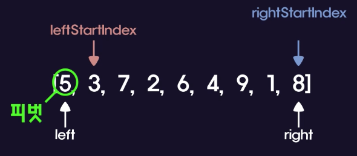

## 퀵정렬

- 병합정렬과 같이 분할 정복 알고리즘에 속하고 재귀를 사용한다.
- 퀵정렬에서는 정렬하기 전에 배열에 있는 숫자 중 하나를 피벗으로 설정해준다.

  - `[5, 3, 7, 2, 6, 4, 9, 1, 8]`
  - 여기서는 배열의 첫 번째 요소 5를 피벗으로 설정하자.  
      
    leftStartIndex : 왼쪽에서 오른쪽으로 이동하는 변수  
    rightStartIndex : 오른쪽에서 왼쪽으로 이동하는 변수  
    left: 첫 번째 인덱스  
    right: 마지막 인덱스
  - 가장 먼저 leftStartIndex가 이동하고 오른쪽으로 이동하다가 피벗보다 큰 값을 만나면 멈춘다.
  - rightStartIndex는 왼쪽으로 이동하다가 피벗보다 작은 값을 만나면 멈춘다.
  - leftStartIndex와 rightStartIndex가 멈추면 둘의 값을 교환한다.
  - 그리고 다시 leftStartIndex가 오른쪽으로 이동하면서 피벗보다 큰 값을 만나면 멈춘다.
  - rightStartIndex도 왼쪽으로 이동하면서 피벗보다 작은 값을 만나면 멈춘다.
  - leftStartIndex와 rightStartIndex가 멈추면 둘의 값을 교환한다.
  - 그리고 다시 이동하는데 rightStartIndex와 leftStartIndex가 서로 만나서 지나치게 된다면 둘다 더 이상 진행하지 않는다.
  - 둘이 서로 지나쳐 멈추게 되면 rightStartIndex는 leftStartIndex의 왼쪽에 있게 된다.
  - 이 상태에서 피벗과 rightStartIndex의 값을 교환한다.
  - 이렇게되면 rightStartIndex를 기준으로 왼쪽은 전부 rightStartIndex보다 작은 값이고,  
    오른쪽은 전부 rightStartIndex보다 큰 값이다.
  - rightStartIndex를 기준으로 좌, 우로 나눠서 모두 퀵정렬을 해주면 배열이 전부 정렬된다.

- 퀵정렬 구현
  - [Code Link](../dev/quick_sort.mjs)
- 퀵정렬의 빅오
  - 피벗이 매번 배열의 반을 가르는 경우 : O(nlogn)
  - 피벗이 배열을 반을 가르지 않고 한쪽에 쏠리는 경우 : O(n^2)
  - 허나 피벗을 잘 선정하면 대부분 O(nlogn)의 성능을 낼 수 있다.
  - 퀵정렬은 병합정렬보다 더 좋은 알고리즘으로 평가된다.
